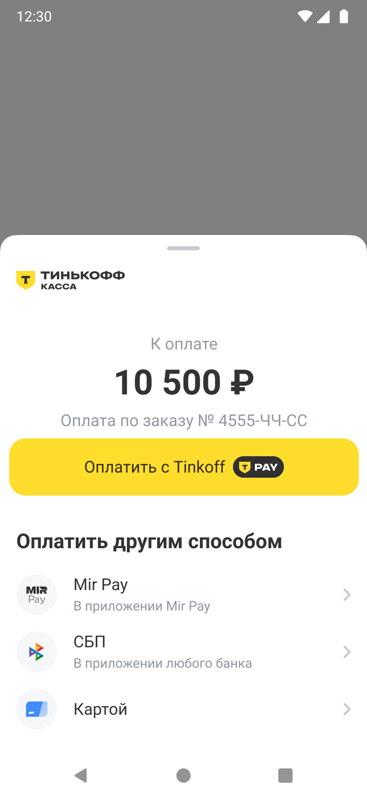
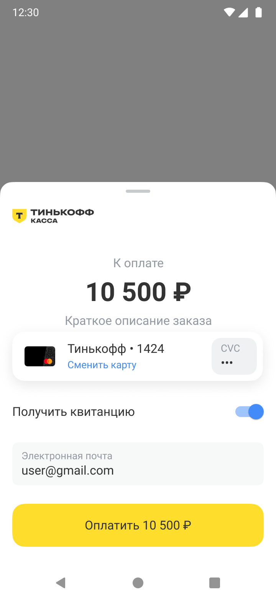
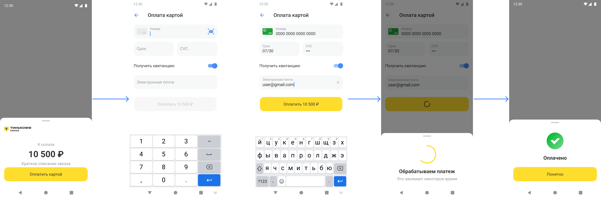
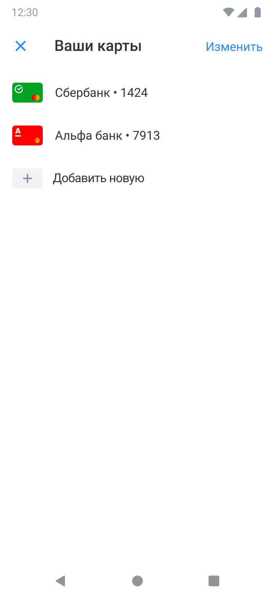
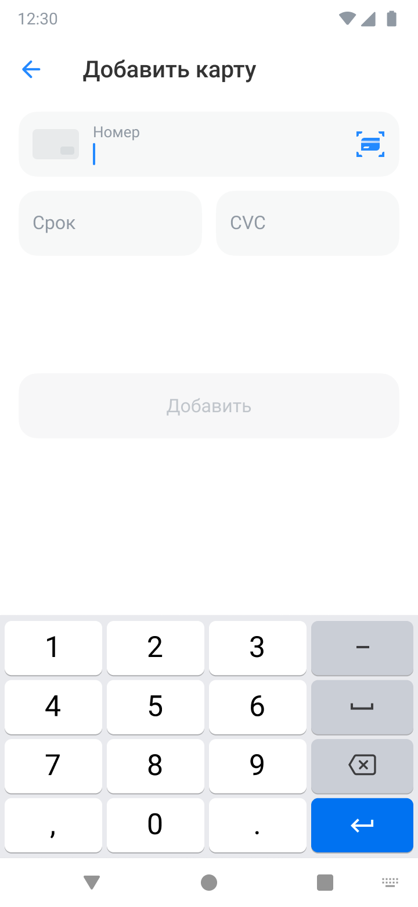

# Tinkoff Acquiring SDK for Android

[][search.maven]

Acquiring SDK позволяет интегрировать [Интернет-Эквайринг Tinkoff][acquiring] в мобильные приложения для платформы Android.

[[_TOC_]]

## Требования
Для работы Tinkoff Acquiring SDK необходимо:
- Android версии 7.0 и выше (API level 24).

## Подключение
### Общая информация
Для работы с SDK вам понадобятся:

- TerminalKey - идентификатор терминала Продавца
- PublicKey – публичный ключ, используемый для шифрования данных

Данные выдаются в личном кабинете (ЛК) после подключения к [Интернет-Эквайрингу Тинькофф][acquiring].
Подробнее о настройке Личного кабинета можно прочитать [в документации](Docs/PersonalAccountSettings.md)

### Подключение зависимостей
Для подключения SDK добавьте в [build.gradle][build-config] вашего проекта следующие зависимости:
```groovy
implementation 'ru.tinkoff.acquiring:ui:$latestVersion'
```
## Совершение платежей
В SDK реализованы как отдельные точки входа для каждого сценария оплаты, так и общая платежная форма, объединяющая в себе доступные способы оплат для Вашего терминала.
>  Для прохождения тест-кейсов и совершения тестовых платежей воспользуйтесь [тестовыми картами](https://www.tinkoff.ru/kassa/dev/payments/index.html#tag/Testovye-karty)
### Оплата с помощью платежной формы

Платежная форма — это форма для оплаты заказа в мобильном приложении, которая объединяет доступные способы оплаты:
- Оплата с помощью банковских карт
    - Оплата новой или существующей картой
    - Управление списком карт для оплаты
- Оплата с помощью Tinkoff Pay
- Оплата с помощью СБП
- Оплата с помощью Mir Pay

> ℹ️ Оплата с помощью `Yandex Pay` доступна через отдельный [сценарий](#отдельный-сценарий-оплаты-через-yandex-pay).

По умолчанию, на платежной форме подключена оплата с помощью банковских карт и `Tinkoff Pay`.
Другие способы оплаты можно подключить по [инструкции](Docs/PersonalAccountSettings.md) через личный кабинет. Варианты визуального представления платежной формы в зависимости от доступных способов оплаты:

<table>
<tr>
    <th>Платежная форма с Tinkoff Pay, СБП, MirPay, Карты</th>
    <th>Платежная форма без привязки карт</th>
    <th>Платежная форма с привязкой карт</th>
</tr>
<tr>
    <td></td>
    <td></td>
    <td></td>
</tr>
</table>

Чтобы настроить платежную форму на обработку платежа, необходимо:
1. Создать структуру [PaymentOptions](./ui/src/main/java/ru/tinkoff/acquiring/sdk/models/options/screen/PaymentOptions.kt), которая состоит из:
   - параметров для проведения оплаты, в том числе данных по заказу [OrderOptions](./ui/src/main/java/ru/tinkoff/acquiring/sdk/models/options/OrderOptions.kt)
   - данных покупателя [CustomerOptions](./ui/src/main/java/ru/tinkoff/acquiring/sdk/models/options/CustomerOptions.kt)
   - опциональных параметров [FeaturesOptions](./ui/src/main/java/ru/tinkoff/acquiring/sdk/models/options/FeaturesOptions.kt)

```kotlin
val paymentOptions =
    PaymentOptions().setOptions {
        setTerminalParams("TERMINAL_KEY", "PUBLIC_KEY")
        orderOptions {                          // данные заказа
            orderId = ORDER-ID                // ID заказа в системе продавца
            amount = Money.ofRubles(10500)       // сумма для оплаты
            recurrentPayment = false            // флаг определяющий является ли платеж рекуррентным (подробнее см. раздел "Рекуррентный платеж")
            receipt = myReceipt                 // данные чека
            description = "Оплата по заказу №" + ORDER-ID  //отображается покупателю на платежной форме
        }
        customerOptions {                       // данные покупателя
            customerKey = "CUSTOMER_KEY"        // уникальный ID пользователя для сохранения данных его карты
            email = "batman@gotham.co"          // E-mail покупателя для отправки уведомления об оплате
        }
        featuresOptions {
            // опциональные параметры
        }
    }
```
2. Зарегистрировать контракт [MainFormLauncher.Contract](./ui/src/main/java/ru/tinkoff/acquiring/sdk/redesign/mainform/MainFormLauncher.kt), и вызвать [ActivityResultLauncher.launch](https://developer.android.com/reference/androidx/activity/result/ActivityResultLauncher#launch(kotlin.Any))
```kotlin
    val mainFormPaymentLauncher = registerForActivityResult(MainFormLauncher.Contract) {
        when(it) {
            MainFormLauncher.Canceled -> Toast.makeText(this, "Cancelled", Toast.LENGTH_LONG).show()
            is MainFormLauncher.Error -> Toast.makeText(this, "Error", Toast.LENGTH_LONG).show()
            is MainFormLauncher.Success -> Toast.makeText(this, "Success", Toast.LENGTH_LONG).show()
        }
    }
    mainFormPaymentLauncher.launch(MainFormLauncher.StartData(paymentOptions))
```
3. Результат платежа вернется в ActivityResultCallback:
   - при успешном платеже возвращается [MainFormLauncher.Success](./ui/src/main/java/ru/tinkoff/acquiring/sdk/redesign/mainform/MainFormLauncher.kt), который содержит:
     - paymentId - идентификатор платежа
     - cardId - id карты оплаты
     - rebillId - Id карты, если был совершен [рекуррентный платеж](#рекуррентный-платеж)
   - при отмене платежа MainFormLauncher.Canceled
   - при неуспешном платеже (_MainFormLauncher.Error_) содержащий Throwable (подробнее об ошибках сервера в [API документации][server-api-errors])

> Чтобы карты не привязывались к покупателю после совершения оплаты, напишите запрос в [поддержку][support-email].
> Однако, следует учитывать, что при каждой оплате, реквизиты карты (номер карты, CVC, Срок) придется вводить повторно:
> 
>

Подробный пример использования сценариев оплаты через `платежную форму` можно найти в файле [PaymentExampleActivity.kt](./sample/src/main/java/ru/tinkoff/acquiring/sample/example/PaymentExampleActivity.kt)

### Отдельный сценарий оплаты через Tinkoff Pay
Tinkoff Pay - это способ оплаты онлайн-покупок в интернет-магазинах без ввода данных карты: покупки можно оплатить прямо из мобильного банка Тинькофф. Оплата возможна только со счетов Тинькофф.
Для подключения оплаты с помощью кнопки сервиса Tinkoff Pay необходимо:
1. Cоздать экземпляр TinkoffAcquiring:
```kotlin
val tinkoffAcquiring = TinkoffAcquiring(
            context = this,
            terminalKey = TERMINAL_KEY,
            publicKey = PUBLIC_KEY
        )
```
2. Настроить структуру [PaymentOptions](./ui/src/main/java/ru/tinkoff/acquiring/sdk/models/options/screen/PaymentOptions.kt)
```kotlin
    val options = PaymentOptions().setOptions {
        setTerminalParams(
            terminalKey = TERMINAL_KEY,
            publicKey = PUBLIC_KEY
        )
        orderOptions {
            orderId = ORDER_ID
            amount = Money.ofRubles(10)
        }
    }
```
3. Зарегистрировать контракт TpayLauncher.Contract
```kotlin
    val launcher = registerForActivityResult(TpayLauncher.Contract) { result ->
        when (result) {
            is TpayLauncher.Canceled -> Log.d(TAG, "Cancelled")
            is TpayLauncher.Error -> Log.d(TAG, "Error")
            is TpayLauncher.Success -> Log.d(TAG, "Success")
        }
    }
```
4. Проверить доступность Tinkoff Pay с помощью метода `checkTerminalInfo` и запустить оплату:
```kotlin
 tinkoffAcquiring.checkTerminalInfo( // Получение информации о доступных способах оплаты
        onSuccess = { terminalInfo ->
            val version = terminalInfo?.getTinkoffPayVersion()
            if (version != null) {
                launcher.launch(
                    TpayLauncher.StartData(
                        paymentOptions = options,
                        version = version
                    )
                )
            }
        },
        onFailure = {
            Log.e(TAG, it.message, it)
        }
    )
```
Результат оплаты вернется в `ActivityResultCallback` в виде `TpayLauncher.Result`

Подробный пример использования отдельного сценария оплаты `Tinkoff Pay` можно найти в файле [TinkoffPayPaymentExampleActivity.kt](./sample/src/main/java/ru/tinkoff/acquiring/sample/example/TinkoffPayPaymentExampleActivity.kt)

> 💡 Данный способ оплаты также доступен через [платежную форму](#оплата-с-помощью-платежной-формы)

Если `Tinkoff Pay` не доступен для оплаты, проверьте его подключение через личный кабинет или обратитесь в [поддержку][support-email]

### Отдельный сценарий оплаты через СБП
СБП - это сервис, который позволяет мгновенно переводить с дебетовой карты или счёта по номеру телефона без комиссии клиентам банков-участников СБП.

Для подключения оплаты с помощью отдельной кнопки `СБП` необходимо:

1. Cоздать экземпляр TinkoffAcquiring:
```kotlin
val tinkoffAcquiring = TinkoffAcquiring(
            context = this,
            terminalKey = TERMINAL_KEY,
            publicKey = PUBLIC_KEY
        )
```

2. Выполнить инициализацию платежной сессии СБП:
```kotlin
  tinkoffAcquiring.initSbpPaymentSession()
```

3. Настроить структуру [PaymentOptions](./ui/src/main/java/ru/tinkoff/acquiring/sdk/models/options/screen/PaymentOptions.kt)
```kotlin
    val options = PaymentOptions().setOptions {
        setTerminalParams(
            terminalKey = TERMINAL_KEY,
            publicKey = PUBLIC_KEY
        )
        orderOptions {
            orderId = ORDER_ID
            amount = Money.ofRubles(10)
        }
    }
```
4. Зарегистрировать контракт [TsbpLauncher.Contract]()
```kotlin
    val launcher = registerForActivityResult(SbpPayLauncher.Contract) { result ->
        when (result) {
            is SbpPayLauncher.Canceled -> Log.d(TAG, "Cancelled")
            is SbpPayLauncher.Error -> Log.d(TAG, "Error")
            is SbpPayLauncher.Success -> Log.d(TAG, "Success")
            is SbpPayLauncher.NoBanks -> Log.d(TAG, "No banks")
        }
    }
```
5. Проверить доступность СБП с помощью метода `checkTerminalInfo` и запустить оплату:
```kotlin
tinkoffAcquiring.checkTerminalInfo( // Получение информации о доступных способах оплаты
        onSuccess = { terminalInfo ->
            if (terminalInfo?.paymethods?.any { it.paymethod == Paymethod.SBP } == true) {
                launcher.launch(
                    SbpPayLauncher.StartData(
                        paymentOptions = options
                    )
                )
            }
        },
        onFailure = {
            Log.e(TAG, it.message, it)
        }
    )
```
Подробный пример использования отдельного сценария оплаты `СБП` можно найти в файле [SBPPayPaymentExampleActivity.kt](./sample/src/main/java/ru/tinkoff/acquiring/sample/example/SBPPayPaymentExampleActivity.kt)

> 💡 Данный способ оплаты также доступен через [платежную форму](#оплата-с-помощью-платежной-формы)

Если `СБП` не доступен для оплаты, проверьте подключение через личный кабинет или обратитесь в [поддержку][support-email]

### Отдельный сценарий оплаты через Mir Pay

Для подключения способа оплаты `Mir Pay` выполните следующие шаги:

1. Cоздать экземпляр TinkoffAcquiring
```kotlin
val tinkoffAcquiring = TinkoffAcquiring(
            context = this,
            terminalKey = TERMINAL_KEY,
            publicKey = PUBLIC_KEY
        )
```
2. Настроить структуру платежа [PaymentOptions](./ui/src/main/java/ru/tinkoff/acquiring/sdk/models/options/screen/PaymentOptions.kt)
```kotlin
    val options = PaymentOptions().setOptions {
        setTerminalParams(
            terminalKey = TERMINAL_KEY,
            publicKey = PUBLIC_KEY
        )
        orderOptions {
            orderId = ORDER_ID
            amount = Money.ofRubles(10)
        }
    }
```
3. Зарегистрировать контракт [MirPayLauncher.Contract]()
```kotlin
    val launcher = registerForActivityResult(MirPayLauncher.Contract) { result ->
        when (result) {
            is MirPayLauncher.Canceled -> Log.d(TAG, "Cancelled")
            is MirPayLauncher.Error -> Log.d(TAG, "Error")
            is MirPayLauncher.Success -> Log.d(TAG, "Success")
        }
    }
```
4. Запустить процесс оплаты по алгоритму:
   - Проверить доступность Mir Pay с помощью метода `checkTerminalInfo`, 
   - Проверить, установлено ли приложение с указанным пакетом на устройстве`packageManager.isPackageInstalled("ru.nspk.mirpay")`
   - Не забудьте про действия, если приложение не установлено
   - Запустить оплату:
```kotlin
        tinkoffAcquiring.checkTerminalInfo( // Получение информации о доступных способах оплаты
            onSuccess = { terminalInfo ->
                val isMirPayEnabled = terminalInfo?.paymethods?.any { it.paymethod == Paymethod.MirPay } == true
                val isMirPayAppInstalled = packageManager.isPackageInstalled("ru.nspk.mirpay")
                if (isMirPayEnabled && isMirPayAppInstalled) {
                    launcher.launch(
                        MirPayLauncher.StartData(
                            paymentOptions = options
                        )
                    )
                }
            },
            onFailure = {
                Log.e(TAG, it.message, it)
            }
        )
```
Подробный пример использования отдельного сценария оплаты `Mir Pay` можно найти в [MirPayPaymentExampleActivity.kt](./sample/src/main/java/ru/tinkoff/acquiring/sample/example/MirPayPaymentExampleActivity.kt)

> 💡 Данный способ оплаты также доступен через [платежную форму](#оплата-с-помощью-платежной-формы)

Если `Mir Pay` не доступен для оплаты, проверьте подключение через личный кабинет или обратитесь в [поддержку][support-email]

### Отдельный сценарий оплаты через Yandex Pay
Если вы хотите использовать Yandex Pay вместе с AcquiringSdk вам необходимо:
1. Получить в личном кабинете [Yandex](https://pay.yandex.ru/ru/docs/custom/android-sdk/preparing) значение `YANDEX_CLIENT_ID`
2. Укажите полученный `YANDEX_CLIENT_ID` в сборочном скрипте [_build.gradle_][build-config] в качестве значения в `manifestPlaceholders`:
```groovy
android {
  defaultConfig {
    manifestPlaceholders = [
      // Подставьте ваш yandex_client_id
      YANDEX_CLIENT_ID: "12345678901234567890",
    ]
  }
}
```
3. Добавить в [_build.gradle_][build-config]
```groovy
implementation 'ru.tinkoff.acquiring:yandexpay:$latestVersion'
```
> Не рекомендуется использовать `ru.tinkoff.acquiring:yandexpay` вместе с `com.yandex.pay:core` в рамках приложения, так как
могут возникнуть непредвиденные ошибки.
4. Cоздать экземпляр TinkoffAcquiring:
```kotlin
val tinkoffAcquiring = TinkoffAcquiring(
            context = this,
            terminalKey = TERMINAL_KEY,
            publicKey = PUBLIC_KEY
        )
```
5. Настроить структуру платежа [PaymentOptions](./ui/src/main/java/ru/tinkoff/acquiring/sdk/models/options/screen/PaymentOptions.kt)
```kotlin
    val options = PaymentOptions().setOptions {
        setTerminalParams(
            terminalKey = TERMINAL_KEY,
            publicKey = PUBLIC_KEY
        )
        orderOptions {
            orderId = ORDER_ID
            amount = Money.ofRubles(10)
        }
    }
```
6. Зарегистрировать контракт [YandexPaymentLauncher.Contract]()
```kotlin
    val launcher = registerForActivityResult(YandexPaymentLauncher.Contract) { result ->
        when (result) {
            is YandexPaymentLauncher.Result.Cancelled -> Log.d(TAG, "Cancelled")
            is YandexPaymentLauncher.Result.Error -> Log.d(TAG, "Error")
            is YandexPaymentLauncher.Result.Success -> Log.d(TAG, "Success")
        }
    }

```
7. Запустить оплату по следующему алгоритму:
   - Проверить доступность оплаты Yandex Pay через метод `checkTerminalInfo`
   - Получить расширение `mapYandexPayData`
   - Создать кнопку Yandex Pay через создание фрагмента `TinkoffAcquiring.createYandexPayButtonFragment`.

После выбора карты в кошельке Yandex Pay процесс оплаты запустится самостоятельно:
```kotlin
    tinkoffAcquiring.checkTerminalInfo( // Получение информации о доступных способах оплаты
        onSuccess = { terminalInfo ->
            if (terminalInfo?.enableYandexPay() == true) {

                val yandexPayData = terminalInfo.mapYandexPayData()

                requireNotNull(yandexPayData) { "Что-то пошло не так" }

                val yandexPayButtonFragment =
                    tinkoffAcquiring.createYandexPayButtonFragment(
                        activity = this,
                        yandexPayData = yandexPayData,
                        options = paymentOptions,
                        onYandexSuccessCallback = {
                            launcher.launch(
                                YandexPaymentLauncher.Params(
                                    tinkoffAcquiring = tinkoffAcquiring,
                                    options = paymentOptions,
                                    yandexPayToken = it.token,
                                    paymentId = it.paymentOptions.paymentId
                                )
                            )
                        }
                    )
                supportFragmentManager.beginTransaction()
                    .add(R.id.button_fragment_container, yandexPayButtonFragment)
                    .commit()
            }
        },
        onFailure = {
            Log.e(TAG, it.message, it)
        }
    )
```
Варианты кастомизации кнопки YandexPay описаны на [отдельной](./Docs/Yandex-pay-in-ASDK.md) странице.

Подробный пример использования отдельного сценария оплаты `Yandex Pay` можно найти в [YandexPayPaymentExampleActivity.kt](./sample/src/main/java/ru/tinkoff/acquiring/sample/example/YandexPayPaymentExampleActivity.kt)

Если `Yandex Pay` не доступен для оплаты, проверьте подключение через личный кабинет или обратитесь в [поддержку][support-email]

## Рекуррентный платеж
Рекуррентные платежи — это повторяющиеся переводы денег с карты или счета покупателя на счет бизнеса. Еще их называют автоплатежами.
Рекуррентные платежи подходят бизнесу с подписной моделью: покупатель привязывает карту или счет и соглашается на регулярное списание, например по графику раз в месяц или по условиям, которые устанавливает бизнес. 
Следующий платеж списывается автоматически, покупателю не нужно еще раз подтверждать оплату.

Для возможности использования рекуррентных платежей, необходимо:
1. Совершить [первичный платеж](#первичный-платеж) или выполнить [привязку карты](#привязка-новой-карты)
2. Выполнить [повторный платеж](#повторный-платеж-автоплатеж) по полученному `rebillId` на шаге 1.

### Первичный платеж
Для совершения первичного платежа, в структуру `orderOptions` необходимо передать параметры `recurrentPayment = true` и `customerKey`:
```Kotlin
val paymentOptions =
    PaymentOptions().setOptions {
        setTerminalParams("TERMINAL_KEY", "PUBLIC_KEY")
        orderOptions {                          // данные заказа
            orderId = ORDER_ID                  // ID заказа в системе продавца
            amount = Money.ofRubles(1000)       // сумма для оплаты
            recurrentPayment = true            // флаг определяющий является ли платеж рекуррентным (подробнее см. раздел "Рекуррентный платеж")
            receipt = myReceipt                // данные чека
            description = "Оплата по заказу № " + ORDER_ID //отображается покупателю на платежной форме
        }
        customerOptions {                       // данные покупателя
            customerKey = CUSTOMER_KEY          // ID пользователя для сохранения данных его карты
            email = "batman@gotham.co"          // E-mail покупателя для отправки уведомления об оплате
        }
    }
```
Для выполнения первичного платежа воспользуйтесь процессом [оплаты с помощью платежной формы](#оплата-с-помощью-платежной-формы) 

> На текущий момент рекуррентный платеж доступен при оплате банковской картой.

### Повторный платеж (автоплатеж)
Для выполнения автоплатежа необходимо обеспечить выполнение метода [/Charge](https://www.tinkoff.ru/kassa/dev/payments/index.html#tag/Rekurrentnyj-platyozh/paths/~1Charge/post) на стороне сервера, в который должен быть передан `RebillId` карты, полученный при совершении первичного платежа.

В рамках текущего проекта рассмотрим частный случай выполнения рекуррентных платежей - оплата картой без повторного ввода CVC и СМС.
Пример состоит из следующих частей:
 - `ChooseCardLauncher` -  запуск выбора карты для оплаты. Список состоит из карт, по которым уже был выполнен первичный платеж.
 - `RecurrentPayLauncher` - запуск рекуррентного платежа выбранной картой.

При наличии идентификатора рекуррентого платежа `rebillId`, вы также сможете запустить рекуррентный платеж через`RecurrentPayLauncher` без использования `ChooseCardLauncher`.

При попытке списать средства сервер может вернуть ошибку `ErrorCode = 104`. Это означает, что необходимо запросить у пользователя повторный ввод CVC-кода карты и заново инициировать платеж.
SDK обладает всем необходимым набором данных для обработки такой ошибки, поэтому на стороне клиентского кода никаких дополнительных действий совершать не требуется.

Подробный пример использования сценария оплаты `повторного рекуррентного платежа` можно найти в [RecurrentPaymentExampleActivity.kt](./sample/src/main/java/ru/tinkoff/acquiring/sample/example/RecurrentPaymentExampleActivity.kt)

## Управление банковскими картами
Помимо платежей в SDK предусмотрены отдельные точки входа для экранов управление картами. 
Сценарий интересен в случаях, когда управление картами реализовано отдельно от сценариев оплаты.
### Список сохраненных карт
<p align="left">

</p>
Для открытия экрана со списком сохраненных карт достаточно вызвать:

```kotlin
val tinkoffAcquiring = TinkoffAcquiring(
    context = this,
    terminalKey = TERMINAL_KEY,
    publicKey = PUBLIC_KEY
)

val savedCardsOptions = tinkoffAcquiring.savedCardsOptions {
    allowNewCard = true // true - разрешить добавление новой карты, false - не разрешать добавление
    customerOptions {
        checkType = CheckType.NO.toString() 
        customerKey = CUSTOMER_KEY
    }
}

val launcher = registerForActivityResult(ChooseCardLauncher.Contract) {
    // Обработка результата
}

launcher.launch(ChooseCardLauncher.StartData(savedCardsOptions))
```
Используются следующие параметры:
- `checkType` - тип проверки привязки карты. Подробнее см. раздел [Инициализация привязки карты к клиенту](https://www.tinkoff.ru/kassa/dev/payments/index.html#tag/Metody-raboty-s-kartami/paths/~1AddCard/post]) в API документации
- `customerKey` - Идентификатор покупателя в системе Магазина. По указанному ключу происходит привязка карты.

### Привязка новой карты
<p align="left">

</p>
Возможность привязать новую карту доступна пользователю с экрана со списком карт, но при необходимости вы можете самостоятельно встроить ее в свое приложение:

```kotlin
    val attachCardOptions = tinkoffAcquiring.attachCardOptions {
        customerOptions {
            checkType = CheckType.NO.toString()
            customerKey = CUSTOMER_KEY
        }
    }

    val launcher = registerForActivityResult(AttachCardLauncher.Contract) {
     // Обработка результата
    }

    launcher.launch(attachCardOptions)
```

Результат вызова метода вернется в **ActivityResultCallback** в виде **AttachCard.Result**:
- при успешной привязке (_AttachCard.Success_) возвращается _cardId_ - id карты, которая была привязана, тип String
- при неуспешной привязке (_AttachCard.Error_) возвращается ошибка _error_ типа Throwable (подробнее о возвращаемых ошибках в [документации][server-api])

## Надежность и безопасность
### Обеспечение работы с SSL/TLC сертификатами Минцифры
На случай отзыва глобальных сертификатов в SDK, необходимо добавить в [_network-security-config_][network-security-config]
сертификаты от минцифр и доп. сертификат от тинькофф. Пример:

```xml
<?xml version="1.0" encoding="utf-8"?>
<network-security-config>
    <base-config>
        <trust-anchors>
            <certificates src="system" />
            <certificates src="@raw/acq_tinkoff_root_cert" />
            <certificates src="@raw/acq_ministry_of_digital_development_root_cert" />
        </trust-anchors>
    </base-config>
</network-security-config>
```
### Подпись запросов с помощью токена

>:warning: По умолчанию проверка токенов на терминале отключена, включить проверку подписи запросов вы можете через ЛК.

Для генерации токена необходимо:

- Добавить пароль от терминала в словарь с ключом `Password`
- Отсортировать пары ключ-значение по ключам в алфавитном порядке
- Конкатенировать значения всех пар
- Для полученной строки вычислить хэш SHA-256

Пример реализации алгоритма генерации токена можно найти в [SampleAcquiringTokenGenerator.kt](./core/src/main/java/ru/tinkoff/acquiring/sdk/utils/SampleAcquiringTokenGenerator.kt?ref_type=heads)

> :warning: **Реализация выше приведена исключительно в качестве примера**. В целях  безопасности не стоит хранить и как бы то ни было взаимодействовать с паролем от терминала в коде мобильного приложения. Наиболее подходящий сценарий - передавать полученные параметры на сервер, где будет происходить генерация токена на основе параметров и пароля

Подробнее c информацией о подписи запроса можно ознакомиться в документации [серверного API][token-documentation]

## Дополнительные возможности

### Режим отладки
SDK позволяет настроить режим работы (debug/prod). По умолчанию задан режим prod.
Чтобы настроить debug режим, установите параметры:

```kotlin
AcquiringSdk.isDeveloperMode = true // используется тестовый URL (rest-api-test.tinkoff.ru), деньги с карт не списываются
AcquiringSdk.isDebug = true         // включение логирования запросов
```
### Отключение стандартных уведомлений о статусе платежа
Вы можете отключить стандартные уведомления о статусе платежа в виде шторок (`bottom sheets`), если ваш процесс оплаты предполагает использовать собственные уведомления.
Для этого, необходимо установить значение параметра:
```kotlin
        featuresOptions {
            showPaymentNotifications = false
        }
```

### Оплата с существующим paymentId
Для отображения платежной формы и проведения платежа без вызова метода Init можно передать
значение `paymentId` в соответствующие `Launcher`-ы экранов или если не требуется UI, то в `Process`-ы оплаты.

### Proguard
```
-keep class ru.tinkoff.acquiring.sdk.localization.** { *; }
-keep class ru.tinkoff.acquiring.sdk.requests.** { *; }
-keep class ru.tinkoff.acquiring.sdk.models.** { *; }
-keep class ru.tinkoff.acquiring.sdk.yandexpay.models.** { *; } // если подключали яндекс
-keep class ru.rtln.tds.sdk.** { *; }
-keep class org.spongycastle.**
-keep class org.bouncycastle.**
```

## Поддержка
- Если вы обнаружили ошибку, пожалуйста, сообщите о ней в разделе [issues][issues].
- Запросы на добавление новых функций и внесение изменений в функционал следует отправлять через менеджера или на [acq_help@tinkoff.ru][support-email]
- По вопросам, связанным со сценариями платежей и их работой, обращайтесь на [acq_help@tinkoff.ru][support-email]
- [API документация][server-api] по методам оплаты интернет-эквайринга от Тинькофф Кассы

[search.maven]: http://search.maven.org/#search|ga|1|ru.tinkoff.acquiring.ui
[build-config]: https://developer.android.com/studio/build/index.html
[support-email]: mailto:acq_help@tinkoff.ru
[init-documentation]: https://www.tinkoff.ru/kassa/dev/payments/#tag/Standartnyj-platyozh/paths/~1Init/post
[token-documentation]: https://www.tinkoff.ru/kassa/dev/payments/index.html#section/Podpis-zaprosa
[server-api]: https://www.tinkoff.ru/kassa/dev/payments/index.html
[server-api-errors]: https://www.tinkoff.ru/kassa/dev/payments/index.html#tag/Kody-oshibok

[network-security-config]:https://developer.android.com/training/articles/security-config
[issues]: https://opensource.tinkoff.ru/tinkoff-mobile-tech/tinkoff-asdk-android/-/issues
[acquiring]: https://www.tinkoff.ru/kassa/dev/payments/index.html#section/Vvedenie/Podklyuchenie-ekvajringa
